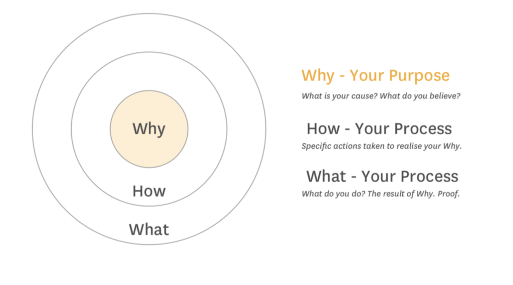

More often we are obessesed with the confidence but in real life on of the 
main factor which supports in achieving the success is clarity. Through out the day/month/years we have different level of confidence. Sometimes you feel more confidence other time we do not have any confidence. 

Having Clarity about the goals and life helps in continue then confidence. 

## GOLDEN CIRCLE
Simen Sinek introduced a framework of Golden Circle. This can help you understand about the process of clarity.

### WHY?
* Why: Do you do what you do ?
* What is the purpose ?
  
   **BELIEFS**
### HOW ?
* How: Do  you do what you do ?
  
   **PROCESS**
### WHAT ?
* What: Do you do ?
  
   **RESULT**

**Purpose drives Action**. Whoever has cleared his WHY(purpose);He has clarity. Those who have clear WHY, can do emotional labour. Next is how to have clarity.

## How to Construct Clarity ?
1. #### Building Empathy
            How to Build Empathy? 

    * Remove Absolute Word from your conversation. 
    * Other have provision to be Right Or Wrong.

1. #### Solving Problems  
    * Being a Enthusiastic problem solver.
1. #### Adding Value
            How to add value? Ask following question to youself daily.
   * what is one new thing that you have done today?
   * what difference you have made today ?
1. ### Emotional Labour
            What is Emotional Labour?
    Emotional Labour is the effort that you have to put into things that you have to do but do not want to do.

      > **Human are prone to laziness**

      Any human whose **WHY(purpose)** is not clear. He would not do emotional labour. Emotional Labour is easy when your **WHY(purpose)** is clear!

